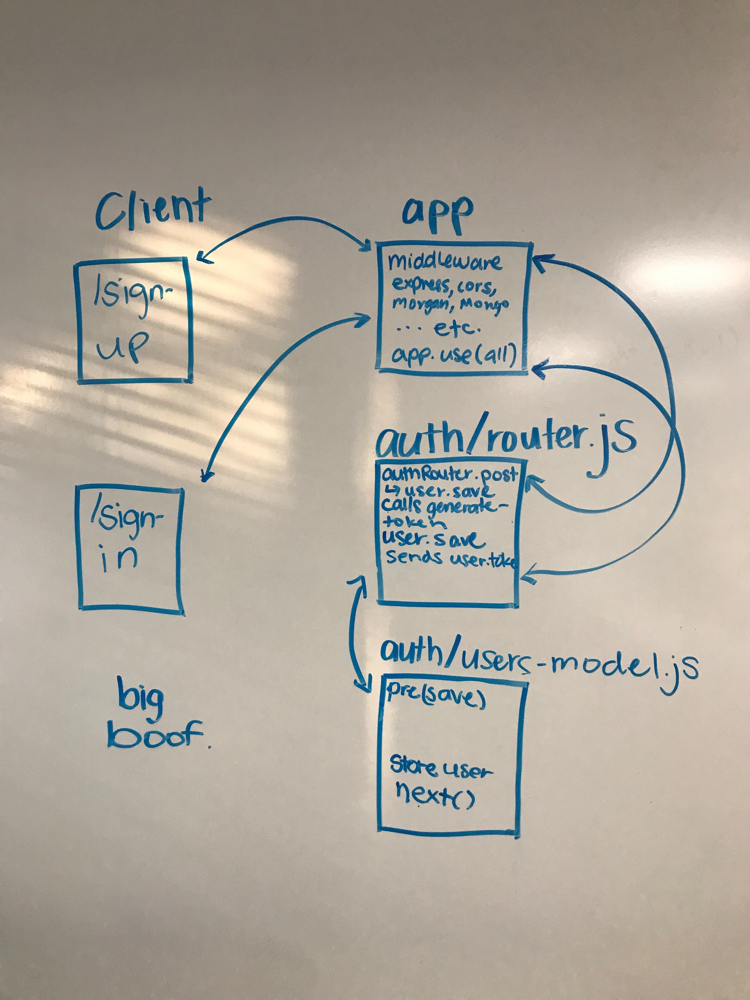

# LAB - 11

## Class 11

### Author: Adriana Graybill

### Links and Resources
* [submission PR](http://xyz.com)
* [travis]()
* [back-end](https://boofalo.herokuapp.com)

### Setup
#### `.env` requirements
* `PORT` - 3000
* `MONGODB_URI` - mongodb://localhost:27017/lab11

#### Running the app
* `npm start`
  
#### Tests
* How do you run tests?
  * npm test
* What assertions were made?
  * Adding an n, adding auth as a parameter
* What assertions need to be / should be made?
  * JSDOC

#### UML

